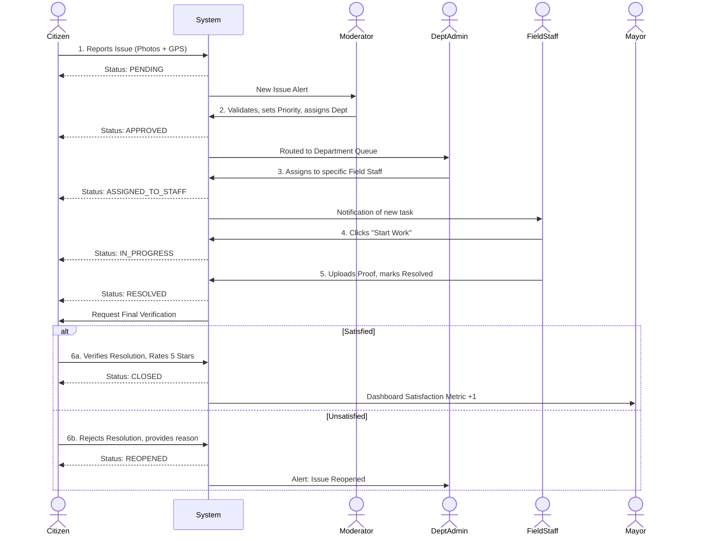

# NayiBareilly: Comprehensive System Overview & User Workflows

NayiBareilly is a complete, role-based civic issue tracking and resolution system designed to bridge the gap between citizens and municipal authorities. The system is built on a robust Role-Based Access Control (RBAC) architecture that ensures every reported issue flows through a structured pipeline—from the moment it's reported by a citizen to its final resolution and verification.

Below is a deep, fully detailed breakdown of every user type in the system, their capabilities, and their specific workflow in the lifecycle of a civic issue.

---

## 1. 👤 Citizen
**Role:** The initiator and end-verifier of the civic improvement process.
**Goal:** Easily report local problems, track their progress in real-time, and confirm when the work is genuinely complete.

### Deep Workflow:
1. **Issue Discovery & Reporting:**
   - A citizen spots a civic issue (e.g., a massive pothole, broken streetlights, unattended garbage).
   - They log into the Citizen Portal (`/`) and use the **Report Issue** tool.
   - They categorize the issue (Roads, Sanitation, Electricity, etc.), provide a description, pin the exact GPS coordinates on a map, and upload photographic evidence.
   - *System Action:* The issue is created with a status of `PENDING` and assigned a unique tracking ID.
2. **Tracking & Real-time Updates:**
   - The citizen can monitor their dashboard (`/my-issues`) to track the exact state of the issue.
   - They receive in-app notifications whenever the status changes (e.g., when a moderator approves it, or staff begins work).
   - They can view public comments and internal notes shared by staff.
3. **Final Verification & Feedback:**
   - Once the field staff marks the issue as `RESOLVED` (and uploads proof), the citizen receives a notification to verify the resolution.
   - They visit the **Verification Page** (`/reports/[id]/verify`).
   - **Scenario A (Satisfied):** The citizen verifies the issue is resolved, rates the service (1-5 stars), and leaves optional feedback. The issue is officially `CLOSED`.
   - **Scenario B (Unsatisfied):** The citizen determines the fix was inadequate. They reject the resolution and provide a "Reason for Reopening." The issue loops back to `IN_PROGRESS` or `ASSIGNED` for further work.

---

## 2. 🛡️ Moderator
**Role:** The frontline gatekeeper and triage specialist.
**Goal:** Filter out spam, validate legitimate reports, assign appropriate priority, and route issues to the correct municipal department.

### Deep Workflow:
1. **Triage & Review:**
   - The moderator monitors the Pending Issues queue on their dashboard (`/moderator/dashboard`).
   - For a new report, the moderator reviews the citizen's description, location, and photos.
   - If the report is invalid, spam, or a duplicate, the moderator can reject it or merge it.
2. **Prioritization & Routing:**
   - If valid, the moderator assesses the severity of the issue and assigns a Priority (`LOW`, `MEDIUM`, `HIGH`, `CRITICAL`).
   - The moderator selects the appropriate Department (e.g., "Public Works", "Water Supply") to handle the fix.
   - They may add internal **Moderator Notes** to give additional context to the field staff.
   - *System Action:* The issue status updates to `APPROVED` or `ASSIGNED_TO_DEPT`.

---

## 3. 🏢 Department Admin
**Role:** The operational manager for a specific municipal sector (e.g., Head of Sanitation).
**Goal:** Oversee all issues routed to their department, balance staff workloads, and ensure Service Level Agreements (SLAs) are met.

### Deep Workflow:
1. **Queue Management:**
   - The Dept Admin reviews all issues that the Moderator routed to their specific department (`/department/issues`).
   - They have a high-level view of their department's analytics (`/department/analytics`)—such as average resolution times and staff performance.
2. **Staff Delegation:**
   - The admin selects a pending issue and evaluates the current workload of their Field Staff.
   - They assign the issue directly to an available, relevant Field Staff member.
   - *System Action:* The issue status updates to `ASSIGNED_TO_STAFF`. The staff member receives an immediate notification.
3. **Escalation & Intervention:**
   - If an issue sits unassigned for too long or breaches its SLA, the Department Admin is flagged to intervene, reassign, or escalate the priority.

---

## 4. 🔧 Field Staff
**Role:** The boots on the ground executing the physical work.
**Goal:** Travel to the issue location, perform the necessary repairs or services, document the fix, and mark the job as done.

### Deep Workflow:
1. **Receiving Assignments:**
   - Staff members check their specific task list (`/staff/assigned`).
   - They view all details: coordinates, citizen photos, moderator notes, and priority level.
2. **Execution & Documentation:**
   - The staff member clicks **"Start Work"**. 
   - *System Action:* The issue status updates to `IN_PROGRESS`.
   - The staff member travels to the location using the built-in navigation links.
   - They perform the necessary civic work.
3. **Resolution Submission:**
   - Once finished, the staff member must provide proof of completion. They upload new photos of the fixed site and write a **Resolution Summary**.
   - *System Action:* The status changes to `WORK_COMPLETED` or `RESOLVED`. An automated notification is fired off to the original citizen requesting final verification.

---

## 5. 👨‍💼 Mayor
**Role:** The executive oversight authority.
**Goal:** Maintain a bird's-eye view of the city's health, monitor departmental efficiency, and handle high-level approvals for critical or heavily escalated issues.

### Deep Workflow:
1. **Executive Dashboarding:**
   - The Mayor accesses the Executive Overview (`/mayor/overview`) to see city-wide analytics, heatmaps of frequent issue zones, and overall citizen satisfaction scores.
2. **Departmental Auditing:**
   - The Mayor can drill down into specific department performance metrics (`/mayor/departments`) to identify bottlenecks (e.g., finding out that the Roads department has a massive backlog of `CRITICAL` issues).
3. **High-Level Interventions:**
   - For major civic works that require budget sign-offs or executive orders, the Mayor reviews and approves them in the `mayor/approvals` queue.

---

## 6. ⚡ Super Admin
**Role:** The master system controller.
**Goal:** Manage the software infrastructure, enforce RBAC boundaries, and maintain the integrity of the data.

### Deep Workflow:
1. **User & Access Management:**
   - The Super Admin can create, edit, or disable user accounts (`/superadmin/users`).
   - They govern Role Assignments (promoting a Citizen to Staff, or assigning a Dept Admin to a specific branch).
2. **System Configurations:**
   - They manage global settings (`/superadmin/departments`), creating new municipal departments, modifying issue categories, and tweaking SLAs.
3. **System Audits & Diagnostics:**
   - They have access to the ultimate Audit Logs (`/superadmin/audit`) to track every single action taken by any user in the system for security and compliance purposes.

---

## 🔄 The Complete "Happy Path" Issue Lifecycle

1. **[CITIZEN]** Reports pothole ➔ `Status: PENDING`
2. **[MODERATOR]** Validates report, sets priority to HIGH, routes to Public Works ➔ `Status: APPROVED`
3. **[DEPT ADMIN (Public Works)]** Sees issue in queue, assigns to Staff Member "John" ➔ `Status: ASSIGNED_TO_STAFF`
4. **[STAFF (John)]** Clicks "Start Work" and goes to site ➔ `Status: IN_PROGRESS`
5. **[STAFF (John)]** Fills pothole, uploads proof photo, marks resolved ➔ `Status: RESOLVED`
6. **[CITIZEN]** Gets notified, reviews proof, clicks "Verify Resolution" and gives 5 stars ➔ `Status: CLOSED`
7. **[MAYOR]** Sees city satisfaction metric rise on the dashboard.

## 📊 Visual Issue Lifecycle (Sequence Diagram)

